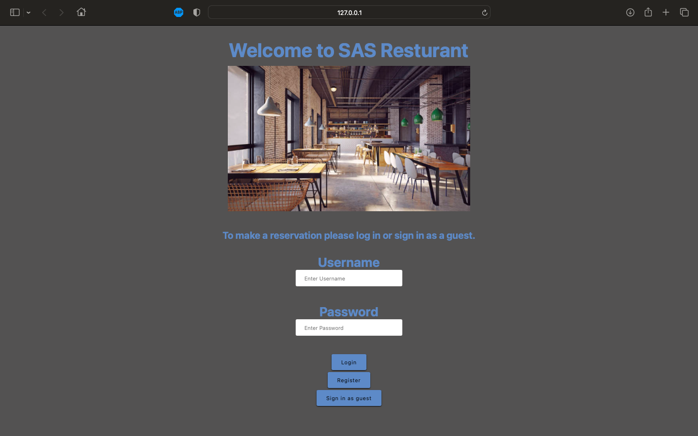
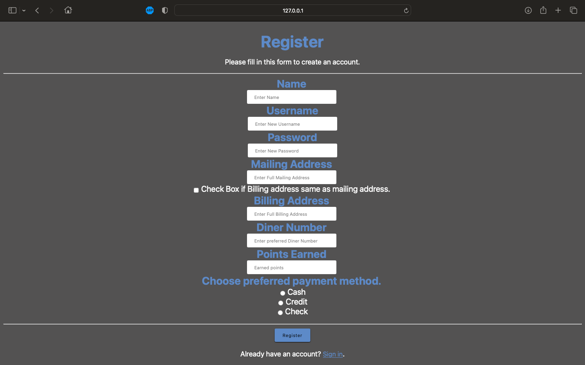
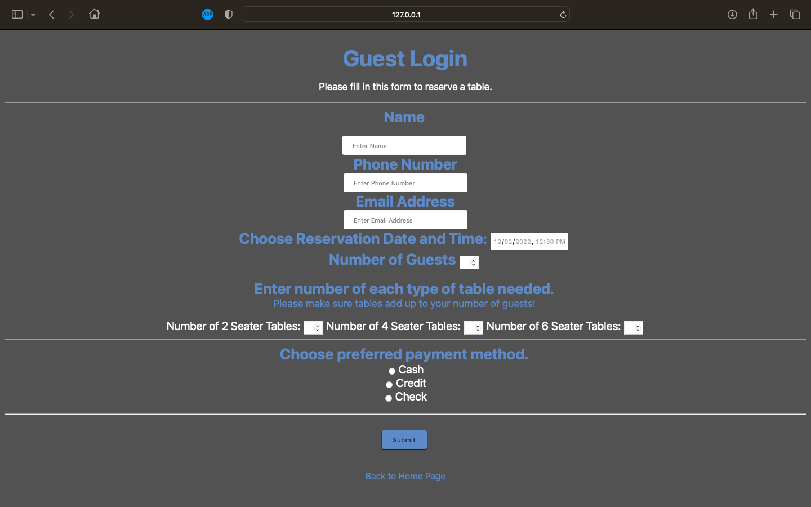

# Group47_COSC4351

Group 47 Restaurant Management System for COSC 4351 class
This is our Restaurant Management System for our COSC 4351 - Fundamentals of Software Engineering Class.

Home Page

Registration

Guest Login

Our database was built for this project using localStorage on the browser, where the user input would be stored as dynamic arrays and be reloaded back into the arrays whenever the page is refreshed. This project includes HTML and CSS design, storage of user input and table reservation and form input validation using JavaScript.

Credits:

1. HTML & CSS: Allen Jacob and Shadmun Talukder Shahed
2. JavaScript: Sai Prashanth Harihar
